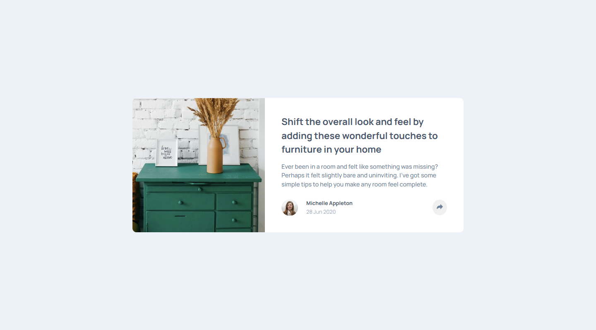
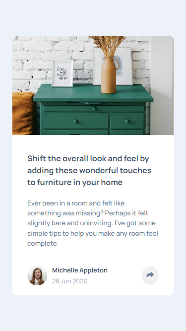

# Frontend Mentor - Article preview component solution

This is a solution to the [Article preview component challenge on Frontend Mentor](https://www.frontendmentor.io/challenges/article-preview-component-dYBN_pYFT). Frontend Mentor challenges help you improve your coding skills by building realistic projects.

## Table of contents

- [Overview](#overview)
  - [The challenge](#the-challenge)
  - [Screenshot](#screenshot)
  - [Links](#links)
- [My process](#my-process)
  - [Built with](#built-with)
  - [What I learned](#what-i-learned)
  - [Continued development](#continued-development)
- [Author](#author)

## Overview

### The challenge

Users should be able to:

- View the optimal layout for the component depending on their device's screen size
- See the social media share links when they click the share icon

### Screenshot

#### Desktop Version



#### Mobile Version



### Links

- Solution URL: [Frontend Mentor]()
- Live Site URL: [GitHub Page](https://anhvu1012.github.io/Article-preview-component/)

## My process

### Built with

- Semantic HTML5 markup
- CSS custom properties
- Flexbox
- CSS Grid
- Mobile-first workflow

### What I learned

I learned how to position a div and adjust its position later on when window is resized and also how to make a div look like a "speech bubble" :D

```css
.share-container {
  background-color: var(--dark-grayish-blue);
  display: none;
  height: 40px;
  align-items: center;
  position: absolute;
  bottom: 0;
  left: 0;
  right: 0;
  padding: 20px 30px;
  border-bottom-left-radius: 10px;
  border-bottom-right-radius: 10px;
}

@media screen and (min-width: 500px) {
  .share-container {
    left: auto;
    bottom: auto;
    top: -70px;
    right: -110px;
    width: auto;
    padding: 8px 35px;
    border-bottom-left-radius: 10px;
    border-bottom-right-radius: 10px;
    border-top-left-radius: 10px;
    border-top-right-radius: 10px;
  }

  .share-container::before {
    content: '';
    position: absolute;
    left: 47%;
    bottom: -10px;
    height: 20px;
    width: 20px;
    transform: rotate(45deg);
    background-color: var(--dark-grayish-blue);
  }
}
```

## Author

- Frontend Mentor - [@anhvu1012](https://www.frontendmentor.io/profile/anhvu1012)
